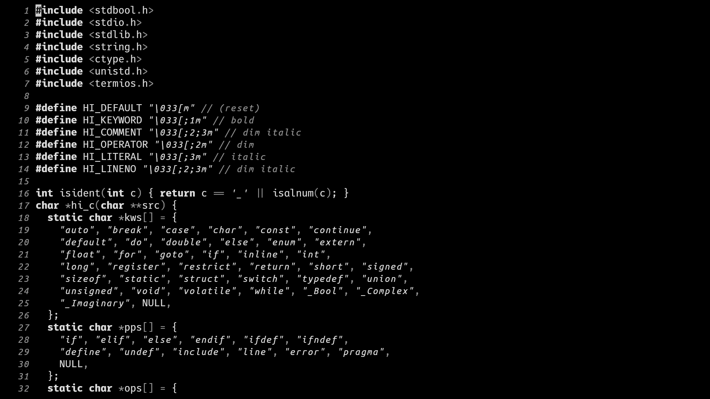

# st4

_Small text editor bootstrapped from `cat`_



## Method

The bootstrapping process consisted of the following stages:

0. Write a rudimentary line editor on paper. Man pages are fair play.
1. Use `cat` with shell redirection to write the stage 0 listing to a file.
2. Bootstrap stage 1 into a more stable, more mature line editor.
3. Use the stage 2 line editor to write a bare-bones screen-based editor.
4. Bootstrap stage 3 into a more usable, more capable screen editor.

## Usage

```bash
# stage 4 (hit <c-h> for help)
make st4
bin/st4 st4.c

# stage 3 (hit <c-h> for help)
make st3
stty -icanon -echo -nl; bin/st3 st3.c; stty sane

# stage 2 (see `st2.c` for help)
make st2
bin/st2 st2.c

# stage 1 (no help page available)
make st1
bin/st1 st1.c

# stage 0 (no help page available)
make st0
```
